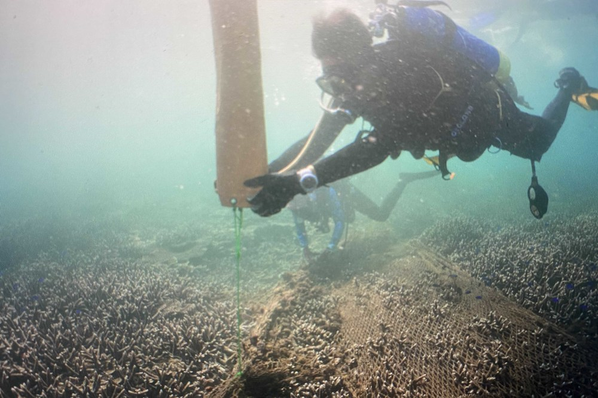

# C108133242 張文嫣

## 組員：

學號        | 姓名   
:----------:|:----:
0631039     | 徐惟厲
C108118201  | 楊筑鈞
C108133314  | 簡鼎翰
C108190147  | 劉昌儒
B109118301  | 鄧穎琳


# 實作題
Emphasis, aka *italics*, with *asterisks* or _underscores_.

Strong emphasis, aka **bold**, with **asterisks** or __underscores__.

Combined emphasis with **asterisks and _underscores_**.

Strikethrough uses two tildes. ~~Scratch this.~~

1. First ordered list item
2. Another ordered item
  * Unordered sub-list item 1
  * Unordered sub-list item 2
3. Actual numbers don't matter, just that it's a number
   1. Ordered sub-list
   2. 2nd sub-list item
5. And another item.
   * note 1
   * note 2
   * note 3

- [ ] todo list item 1
- [ ] 2nd item
- [x] 3rd item done
- [ ] 4th unfinished

```python
s = "Python syntax highlighting"
print(s)
```

```js
var s = "JavaScript syntax highlighting"
alert(s);
```

Tables | Are | Cool
:----|:----:|----:
col 3 is | right-aligned | $1600
col 2 is | centered | $12
zebra stripes | are neat | $1

Markdown | Less | Pretty
----|----|----
*Still* | `renders` | **nicely**
1 | 2 | 3

# 隨堂練習
## Testing H2
### Testing H3
#### Testing H4
##### Testing H5
###### Testing H6

REGULAR TEXT **BOLD_TEXT** *ITALIC TEXT* 

`a little code block`

```python
def print_hi():
  hi = "hello"
  print(hi)
```

😙 😴 😢

[NKUST](https://www.nkust.edu.tw/)




